# 🧠 Smart Agent Routing System

## 🚀 Overview

The new **Smart Routing System** revolutionizes query processing by dynamically selecting only the necessary agents for each query type. This eliminates unnecessary processing and provides **faster, more efficient responses**.

## ❌ Old Problems vs ✅ New Solutions

### **Before: Rigid Pipeline**
```
Every "goal-based" query → ALL agents (even unnecessary ones)
"What's the price of milk?" → Intent + Preference + Meal Planning + Basket + Stock + Feedback
⏱️ Result: 6-8 seconds for a simple price check
```

### **After: Smart Routing**
```
Query-specific agent selection
"What's the price of milk?" → General Query Agent only
⏱️ Result: < 2 seconds with precise answer
```

## 🎯 Query Categories & Routing

### **1. 💰 Price Check Queries**
```
Examples: "What's the price of milk?", "How much does bread cost?"
Agents Used: [General Query] only
Response Time: < 2 seconds
Skip Confirmation: ✅ Yes
```

### **2. 📦 Availability Check Queries**
```
Examples: "Do you have almond milk?", "Is Greek yogurt in stock?"
Agents Used: [General Query] only  
Response Time: < 2 seconds
Skip Confirmation: ✅ Yes
```

### **3. 🏪 Store Information Queries**
```
Examples: "What are your hours?", "Do you offer delivery?"
Agents Used: [General Query] only
Response Time: < 2 seconds  
Skip Confirmation: ✅ Yes
```

### **4. 🥗 Product Recommendation Queries**
```
Examples: "Suggest low-carb snacks", "Recommend high-protein foods"
Agents Used: [Intent, Preference, Product Recommender, Feedback]
Response Time: 3-5 seconds
Skip Confirmation: ❌ No (personalization needed)
```

### **5. 🔄 Substitution Requests**
```
Examples: "What can I substitute for eggs?", "Alternative to almond milk?"
Agents Used: [General Query, Stock Checker]
Response Time: 2-3 seconds
Skip Confirmation: ✅ Yes
```

### **6. 💸 Discount/Promotion Queries**
```
Examples: "What items are on sale?", "Show me current promotions"
Agents Used: [Stock Checker] only
Response Time: < 2 seconds
Skip Confirmation: ✅ Yes
```

### **7. 🍽️ Meal Planning Queries**
```
Examples: "Plan 3 meals under $30", "Create a weekly meal plan"
Agents Used: [Intent, Preference, Meal Planner, Basket Builder, Stock Checker, Feedback]
Response Time: 5-8 seconds
Skip Confirmation: ❌ No (complex personalization)
```

## 🏗️ Architecture Comparison

### **Traditional Routing (Old)**


### **Smart Routing (New)**

```mermaid
graph TD
    A[User Query] --> B[Smart Router Analysis]
    B --> C{Query Category}
    
    C -->|Price Check| D[General Query Only] 
    C -->|Availability| E[General Query Only]
    C -->|Product Rec| F[Intent → Preference → Product Rec → Feedback]
    C -->|Substitution| G[General Query → Stock Checker]
    C -->|Discounts| H[Stock Checker Only]
    C -->|Meal Planning| I[Full Pipeline]
    
    D --> J[⚡ Fast Response]
    E --> J
    F --> K[🎯 Personalized Response]
    G --> L[💡 Smart Suggestions]
    H --> M[💰 Promotion Info]
    I --> N[🍽️ Complete Meal Plan]
    
    style A fill:#e8f5e8
    style J fill:#e8f5e8
    style K fill:#e3f2fd
    style L fill:#fff8e1
    style M fill:#fce4ec
    style N fill:#f3e5f5
```


## 📊 Performance Improvements

| Query Type | Old Time | New Time | Improvement | Agents Saved |
|------------|----------|----------|-------------|--------------|
| Price Check | 6-8s | <2s | **75% faster** | 5 agents |
| Availability | 6-8s | <2s | **75% faster** | 5 agents |
| Store Info | 6-8s | <2s | **75% faster** | 5 agents |
| Discounts | 6-8s | <2s | **75% faster** | 5 agents |
| Product Rec | 6-8s | 3-5s | **40% faster** | 2 agents |
| Substitutions | 6-8s | 2-3s | **65% faster** | 4 agents |
| Meal Planning | 6-8s | 5-8s | **Same** | 0 agents (all needed) |

## 🚀 API Usage

### **New Smart Chat Endpoint**
```http
POST /api/v1/smart-chat
Content-Type: application/json
Authorization: Bearer <token>

{
  "message": "What's the price of organic milk?",
  "session_id": "optional_session_id"
}
```

### **Response Format**
```json
{
  "session_id": "user_123_1699123456",
  "message": "What's the price of organic milk?",
  "query_category": "price_check",
  "execution_plan": {
    "category": "price_check",
    "required_agents": ["general_query"],
    "skip_confirmation": true,
    "response_template": "Here's the pricing information you requested:",
    "estimated_steps": 1,
    "complexity": "simple"
  },
  "agents_executed": ["general_query"],
  "response": "Here's the pricing information you requested:\nOrganic milk is currently $4.99 per gallon.",
  "requires_confirmation": false,
  "is_complete": true,
  "processing_time_ms": 1500
}
```

## 🔧 Implementation Details

### **Smart Router Components**

1. **`classify_query_category()`** - Analyzes message to determine category
2. **`get_required_agents()`** - Maps categories to necessary agents
3. **`should_skip_confirmation()`** - Determines if confirmation is needed
4. **`create_execution_plan()`** - Creates complete execution strategy

### **Flexible LangGraph**

- **Conditional Node Execution** - Agents only run if required
- **Dynamic Routing** - Flow adapts based on query category
- **Skip Logic** - Unnecessary agents are bypassed entirely
- **Response Compilation** - Builds appropriate response from executed agents

## 🧪 Testing & Analysis Tools

### **1. Query Analysis (No Execution)**
```http
POST /api/v1/analyze-query
{
  "message": "Suggest low-carb snacks"
}
```

### **2. Routing Comparison**
```http
POST /api/v1/compare-routing
{
  "message": "What's the price of bread?"
}
```

### **3. Query Examples**
```http
GET /api/v1/query-examples
```

## 🎯 Business Benefits

### **⚡ Performance**
- **75% faster** responses for simple queries
- **Reduced server load** by eliminating unnecessary processing
- **Better scalability** with efficient resource usage

### **👤 User Experience** 
- **Instant answers** for price/availability questions
- **No unnecessary confirmations** for simple queries
- **Personalized responses** only when beneficial

### **💰 Cost Efficiency**
- **Reduced API calls** to LLM services
- **Lower compute costs** with optimized agent usage
- **Better resource allocation** across query types

## 🔄 Migration Strategy

### **Phase 1: Parallel Deployment**
- Deploy smart routing alongside existing system
- Use `/smart-chat` endpoint for testing
- Compare performance metrics

### **Phase 2: Gradual Migration**
- Route simple queries to smart system
- Keep complex queries on old system
- Monitor and optimize

### **Phase 3: Full Migration**
- Replace old routing with smart routing
- Deprecate old endpoints
- Optimize based on usage patterns

## 🔍 Monitoring & Analytics

Track these metrics to measure success:

- **Response time by query category**
- **Agent execution frequency**
- **User satisfaction by routing type**
- **Resource utilization reduction**
- **Error rates by complexity level**

---

## 🎉 Result: The Perfect Agent Flow

The new smart routing system provides:
✅ **Fast answers** for simple questions  
✅ **Personalized recommendations** when needed  
✅ **Full meal planning** for complex requests  
✅ **Efficient resource usage** across all query types  
✅ **Better user experience** with appropriate confirmations  

**No more waiting 8 seconds to know the price of milk!** 🥛⚡ 